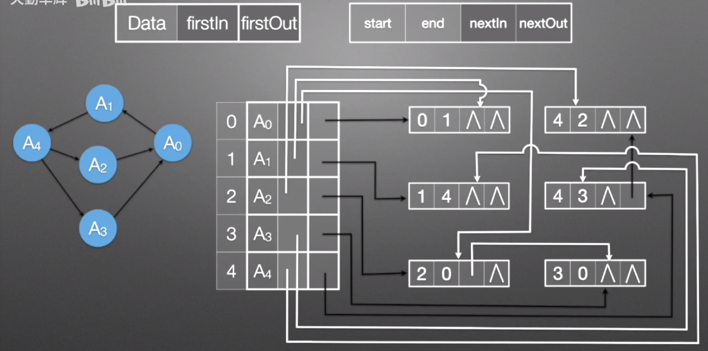
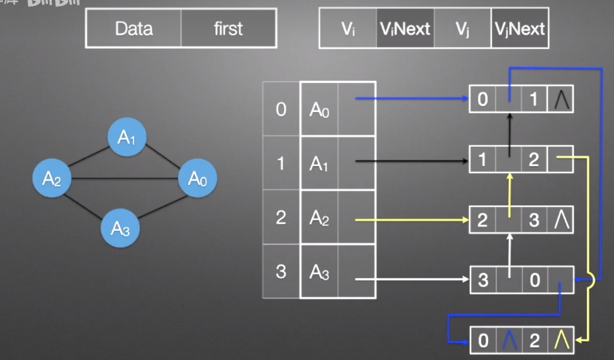

# 图的存储结构
## 邻接矩阵
```cpp
#define MAX 32767

char Vertex[5] = { 'a', 'b', 'c', 'd', 'e' };
double Edge[5][5];

// initialize adjacency matrix
void initAdjacencyMatrixGraph(void) {
    for (int i = 0; i < 5; ++i) {
        for (int j = 0; j < 5; ++j) {
            Edge[i][j] = MAX;
        }
    }
}
```
## 邻接表
```cpp
#define MAXSIZE 100

typedef struct ArcNode {
    int adjacency_index;
    struct ArcNode* next;
} ArcNode;

typedef struct VertexNode {
    char data;
    ArcNode* first;
} VertexNode;

typedef struct {
    VertexNode adjacency_list[MAXSIZE];
    int vertex_num;
    int arc_num;
} AdjacencyListGraph;
```
## 十字链表 : 有向图 邻接表存储改进
#### 特点 : 同时方便找入边出边

## 邻接多重表 : 无向图 邻接表存储改进
#### 特点 : 解决无向图同一条边有多余的结点表示
