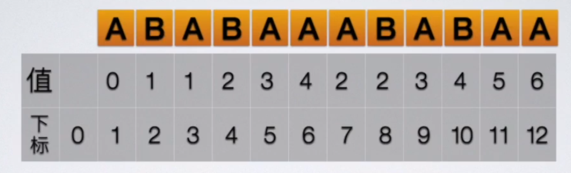
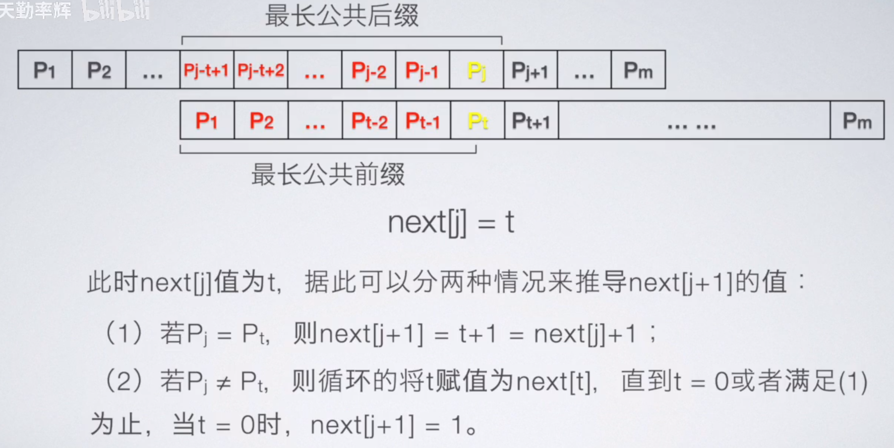
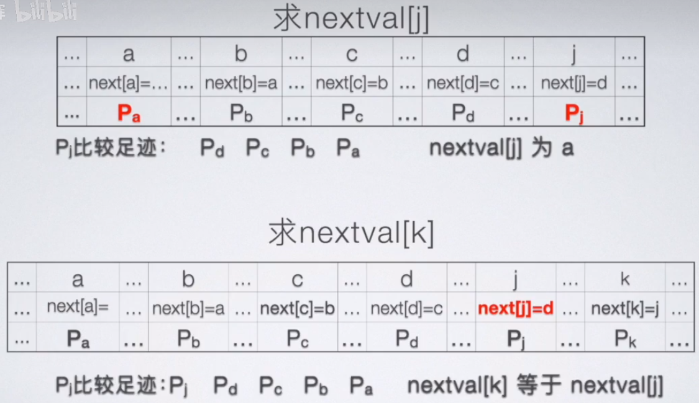
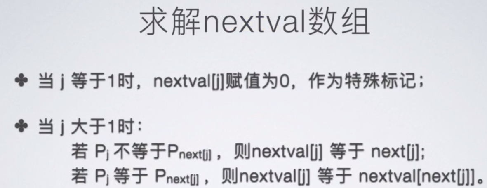

 ==注意== : 以下模式串匹配算法中, 均从str.str[1]开始存储字符, str.str[0]不存储字符
## BF算法
```cpp
void BF(const Str& str, const Str& substr, int pos = 1) {
    int i = pos, j = 1;
    while (i <= str.length && j <= substr.length) {
        if (str.str[i] == substr[j]) {
            ++i;
            ++j;
        }
        else {
            i = i - j + 2;    
            j = 1;            
        }
    }
    if (j > substr.length) {
        return i - substr.length;
    }
    else {
        return 0;
    }
}
```
# KMP算法
## 核心思想
比较指针不回溯
## 最长公共前后缀
小于总长度的最长的公共前后缀
## 使用next数组

当前字符出现不匹配时, 子串比较指针回溯到最长公共前后缀长度 + 1的位置继续与主串进行比较. 
从而实现了逻辑上的比较指针不回溯, 仅是将子串向后移动 ==[当前子串发生不匹配字符的下标 - (每个字符最长公共前后缀长度 + 1)]== 个长度后, 继续与主串进行比较.
## 求解next数组
只用分析子串
### 手工求法 : 每个字符最长公共前后缀长度 + 1
### 函数求法 : 

```cpp
void getNext(Str substr, int next[]) {
    int j = 1, t = 0;
    next[1] = 0;
    while (j < substr.length) {
        if (t == 0 || substr.str[j] == substr.str[t]) {
            next[j + 1] = t + 1;
            ++t;
            ++j;
        }
        else {
            t = next[t];
        }
    }
}
```
### 
## KMP算法
```cpp
int KMP(const Str& str, const Str& substr, int next[]) {
    int i = 1, j = 1;
    while (i <= str.length && j <= str.length) {
        if (j == 0 || str.str[i] == substr.str[j]) {
            ++i;
            ++j;
        }
        else {
            j = next[j];
        }
    }
    if (j >substr.length) {
        return i - substr.length;
    }
    else {
        return 0;
    }
}
```
## 改进KMP算法


### 同时求解next数组 & nextval数组
```cpp
void getNextNextval(Str substr, int next[], int nextval[]) {
    int j = 1, t = 0;
    next[1] = 0;
    nextval[1] = 0;
    while (j < substr.length) {
        if (t == 0 || substr.str[j] == substr.str[t]) {
            next[j + 1] = t + 1;
            if (substr.str[j + 1] != substr.str[next[j + 1]]) {
                nextval[j + 1] = next[j + 1];
            }
            else {
                nextval[j + 1] = nextval[next[j + 1]];
            }
            ++t;
            ++j;
        }
        else {
            t = nextval[t];
        }
    }
}
```
### 求解nextval数组
```cpp
void getNextval(Str substr, int nextval[]) {
    int j = 1, t = 0;
    nextval[1] = 0;
    while (j < substr.length) {
        if (t == 0 || substr.str[j] == substr.str[t]) {
            if (substr.str[j + 1] != substr.str[t + 1]) {
                nextval[j + 1] = t + 1;
            }
            else {
                nextval[j + 1] = nextval[t + 1];
            }
            ++t;
            ++j;
        }
        else {
            t = nextval[t];
        }
    }
}
```
