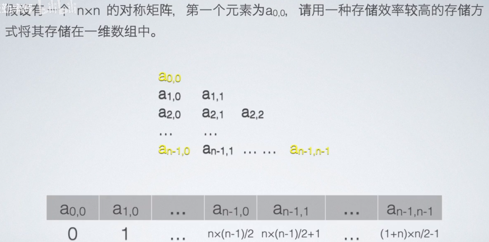
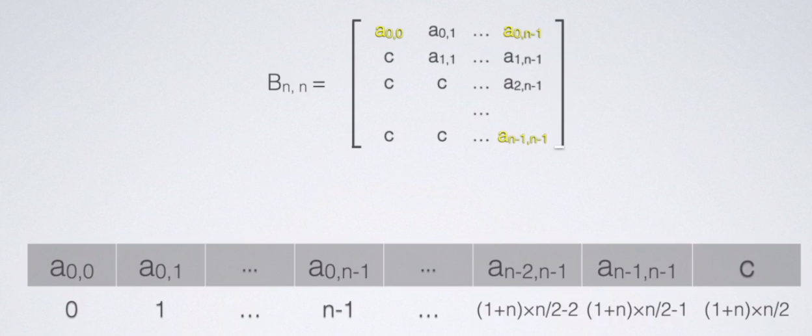
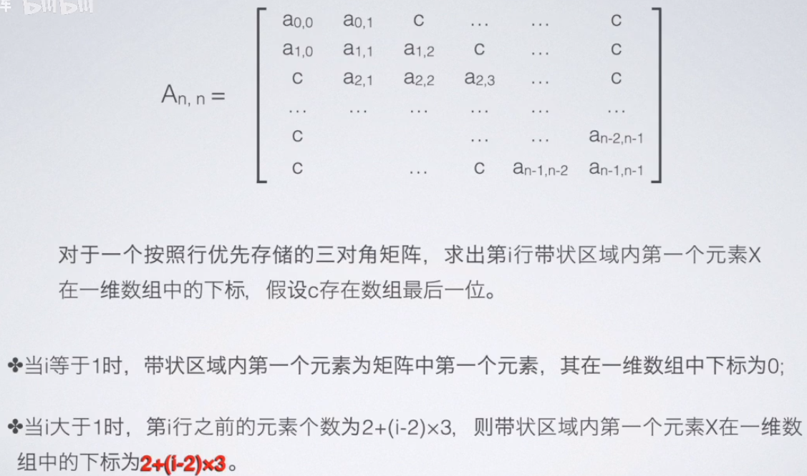
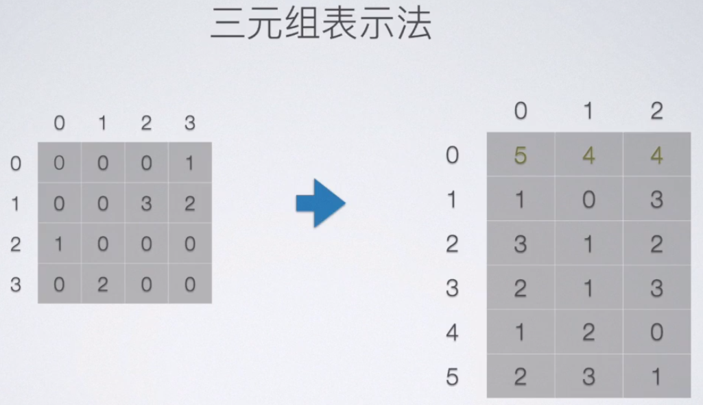
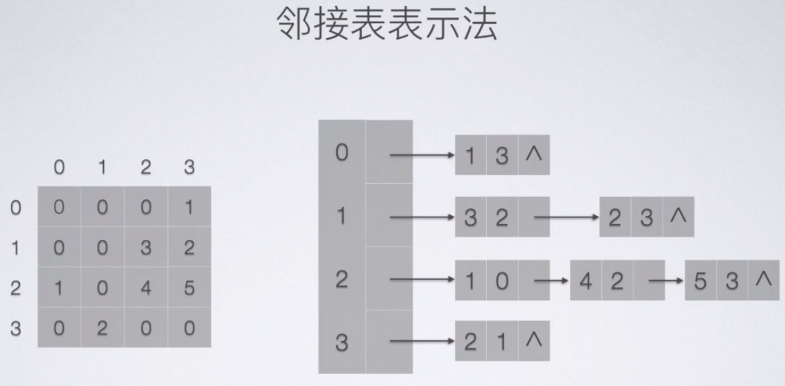
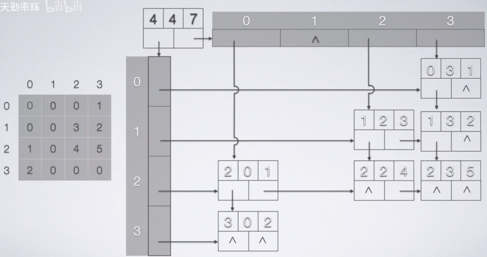
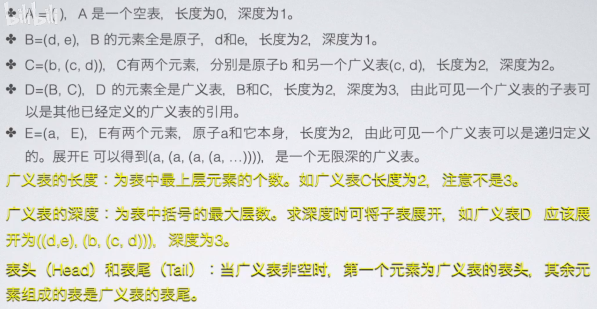
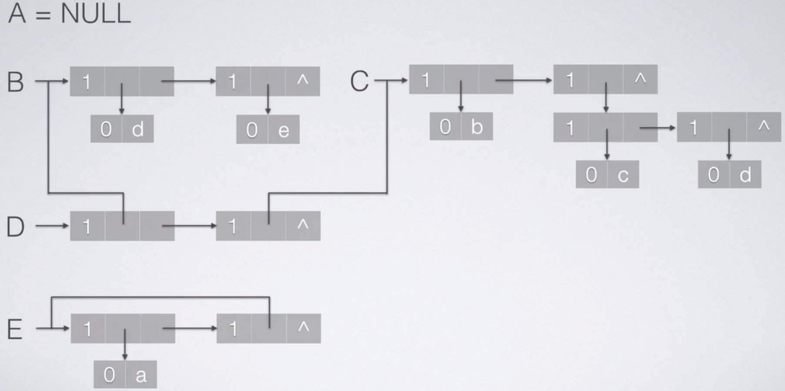
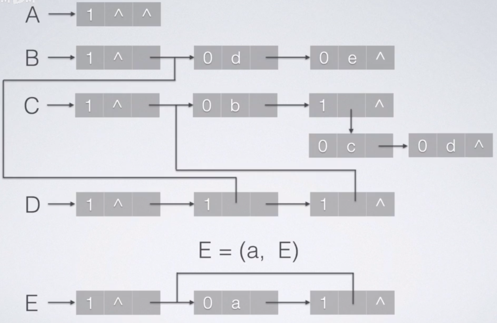

# array & matrix & table
## array

## matrix 

#### 下三角矩阵

#### 上三角矩阵

#### 对角矩阵

#### 三元组存储稀疏矩阵

```cpp
float tri_mat[MAXSIZE + 1][3];

float val = tri_mat[k][0];
int i = (int)tri_mat[k][1];
int j = (int)tri_mat[k][2];
```
```cpp
typedef struct {
    float val;
    int i, j;
} TriMat;

TriMat tri_mat[MAXSIZE + 1];

float val = tri_mat[k].val;
int i = tri_mat[k].i;
int j = tri_mat[k].j;
```
#### 邻接表存储稀疏矩阵

#### 十字链表存储稀疏矩阵


## table


