# 树
### 树链式存储
```cpp
typedef struct Branch {
    int child_index;
    struct Branch* next;
} Branch;

typedef struct {
    int data;
    Branch* first;
} TNode;
```
### 树链式存储(孩子兄度存储结构)
```cpp
typedef struct BTNode {
    int data;
    struct BTNode* child;
    struct BTNode* sibling;
} BTNode;
```
### 树深度优先遍历
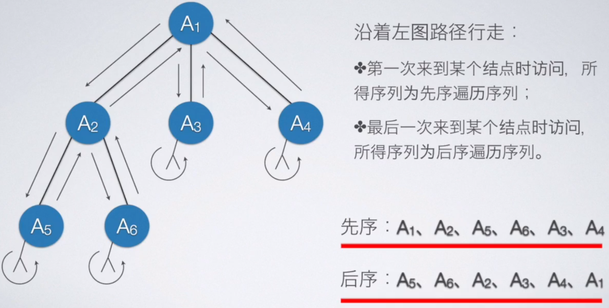
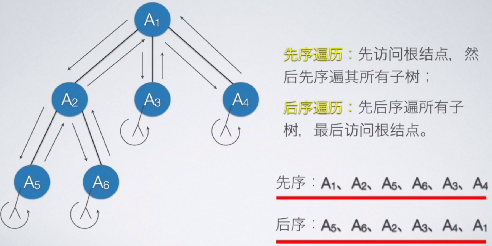
# 二叉树
### 求完全二叉树高度(h)
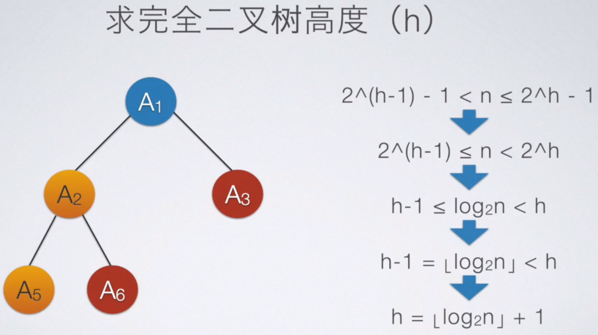
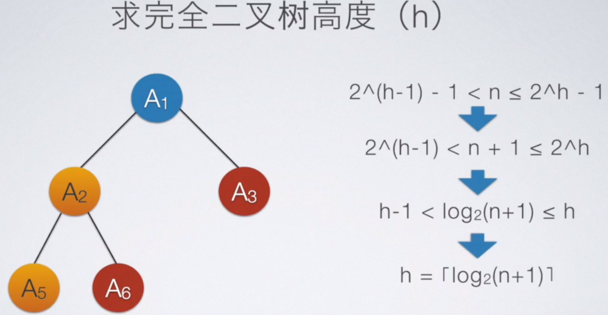
### 二叉树性质
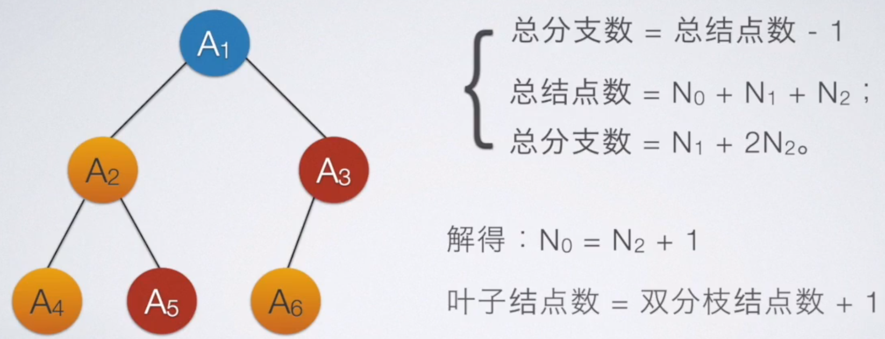
### 度为m的树性质
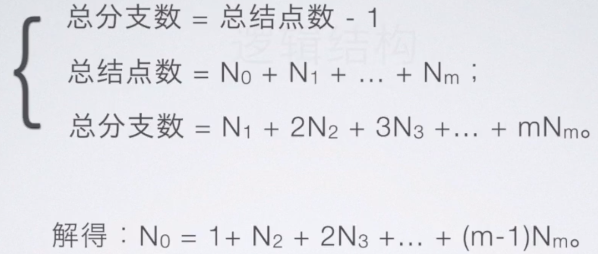
### 二叉树顺序存储
适合存储完全二叉树
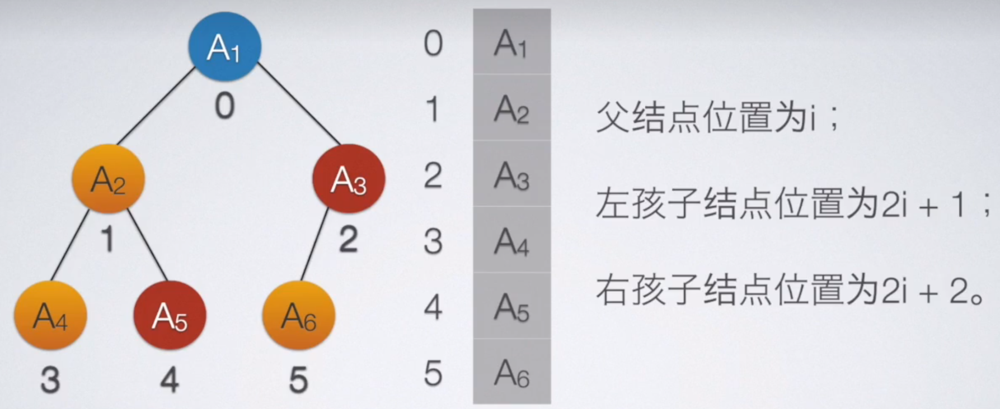
### 二叉树链式存储(二叉链表)
```cpp
typedef struct BTNode {
    int data;
    struct BTNode* lChild;
    struct BTNode* rChild;
} BTNode;
typedef BTNode* BinaryTree;
```
### 二叉树深度优先遍历
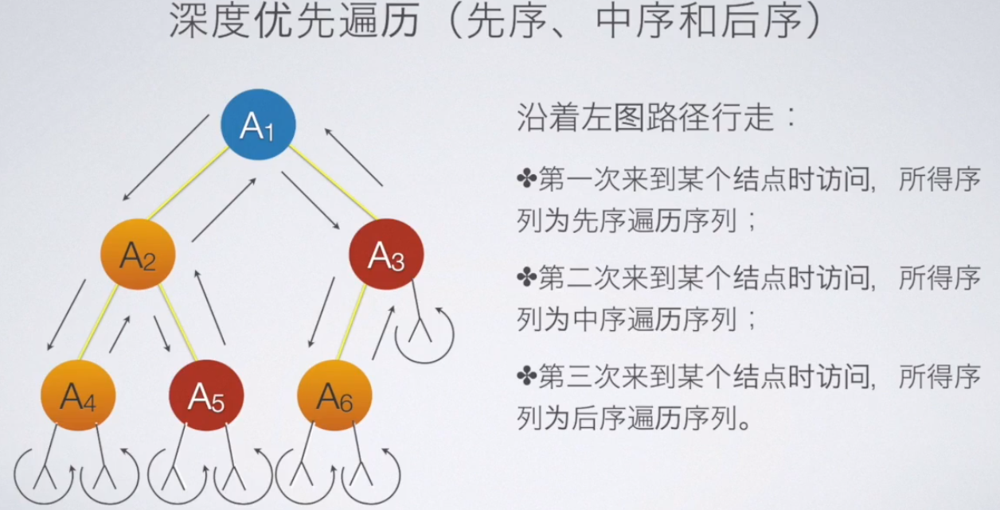
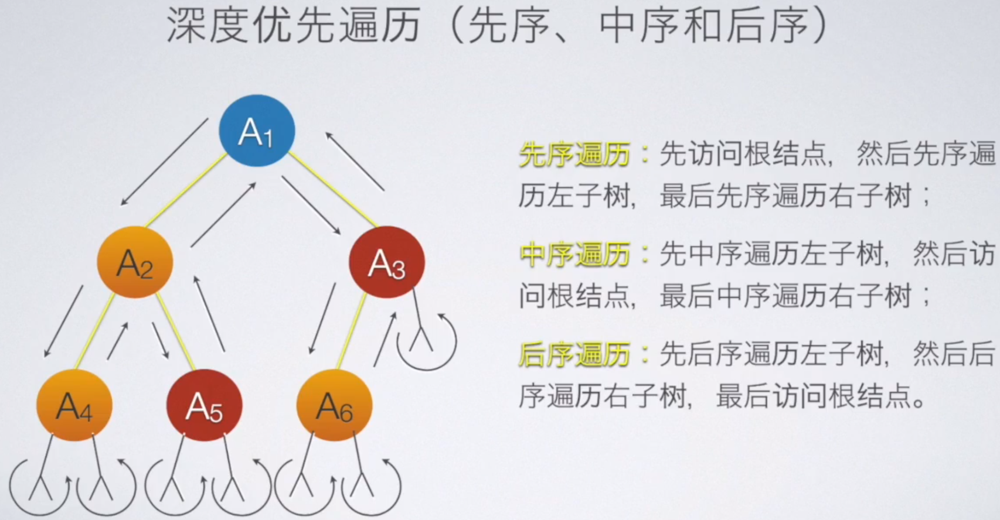
### 树和森林转化为二叉树遍历顺序
树和森林先序遍历 == 树和森林转化的二叉树先序遍历
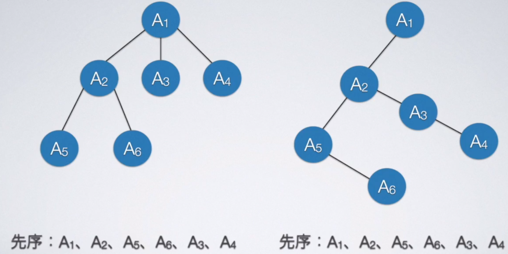
树和森林后序遍历 == 树和森林转化的二叉树后序遍历 


# 线索二叉树
### 中序线索二叉树(方便找前驱后继)
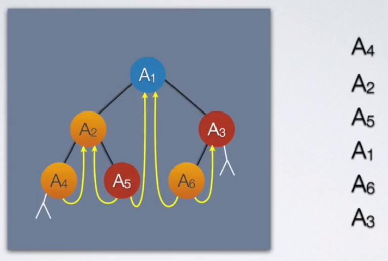
##### 查找遍历序列第一个结点 : 
从根结点一直向左走, 到不能向左走为止的结点.
##### 查找遍历序列最后一个结点 :
从根结点一直向右走, 到不能向右走为止的结点.
##### 查找某个结点(有后继结点)后继结点 :
1. 如果该结点右指针为线索, 则线索指向的为后继结点
2. 如果该结点右指针不为线索, 则从该结点向右走一步, 然后在向左走到头, 则当前结点为该结点的后继结点.
##### 查找某个结点(有前驱结点)前驱结点 :
1. 如果该结点左指针为线索, 则线索指向的为前驱结点
2. 如果该结点左指针不为线索, 则从该结点向左走一步, 然后在向右走到头, 则当前结点为该结点的前驱结点.
### 前序线索二叉树(方便找后继, 不方便找前驱)
##### 查找遍历序列第一个结点 : 
根结点
##### 查找某个结点(有后继结点)前驱和后继结点 :
如果左指针不为空, 且不为线索指针, 左指针指向结点为后继结点.
如果左指针不为空, 为线索指针, 左指针指向结点为前驱结点.
如果左指针为空, 右指针不为空, 右指针不论是孩子指针还是线索指针, 指向的都为该结点的后继结点.
### 后序线索二叉树(不方便找前驱后继)
##### 查找某个结点的后继
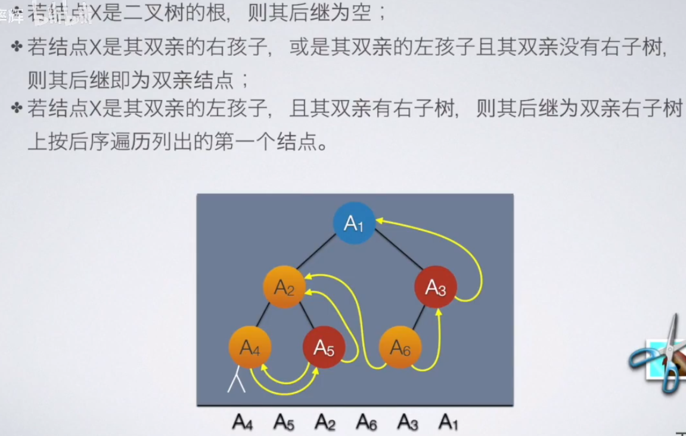
# 通过先序遍历顺序, 中序遍历顺序确定并建立二叉树
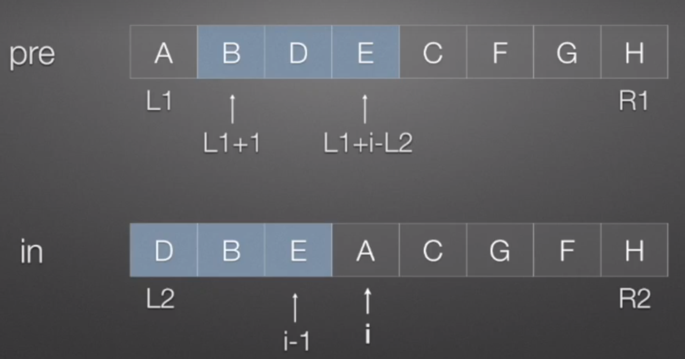
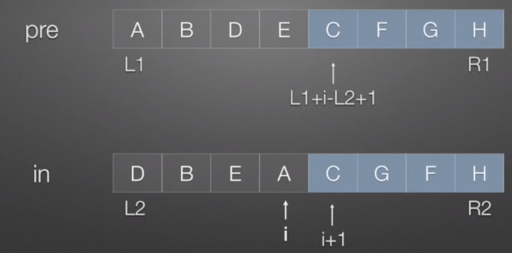
```cpp

```
# 通过后序遍历顺序, 中序遍历顺序确定并建立二叉树

```cpp

```
# 二叉树的估计

# 二叉树表达式
根据中缀表达式建立一个表达式树
所建立的表达式树
先序遍历结果 : 前缀表达式(波兰式)
后序遍历结果 : 后缀表达式(逆波兰式)
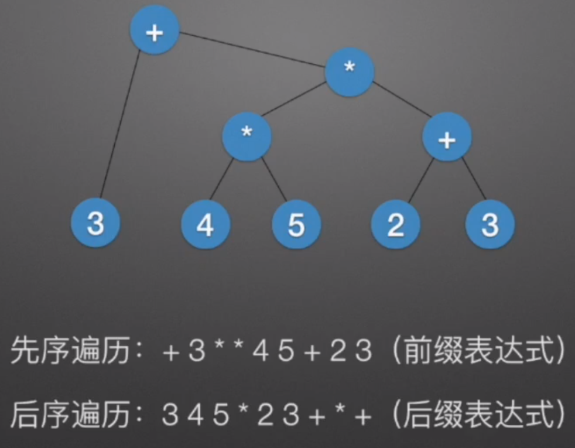